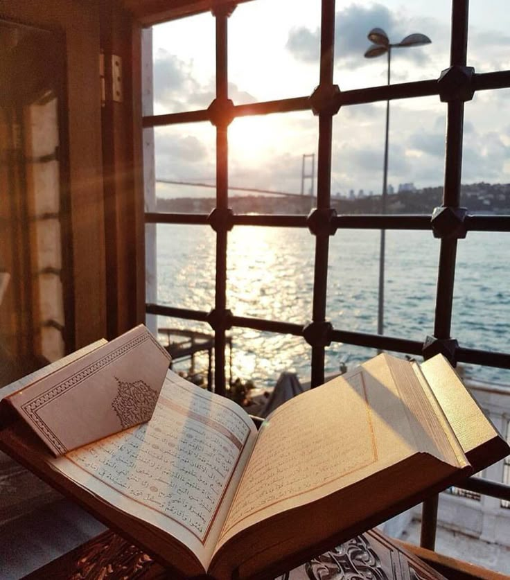

# sands-box.github.io
# P-Math UNS - Pendidikan Agama Islam

Website pembelajaran interaktif tugas project mata kuliah Pendidikan Agama Islam di Universitas Sebelas Maret (UNS).

## Fitur Utama

- **Slide Presentasi** - 5 tampilan slide materi pembelajaran
- **Materi PPT** - Presentasi Canva yang dapat diakses langsung
- **Game Edukasi** - 5 permainan interaktif berbasis Wordwall:
  1. Huruf Hijaiyah
  2. Melengkapi Ayat dalam Surat Alquran
  3. Bacaan Penggalan Ayat
  4. Kuis Pertanyaan Agama
  5. Menyusun Kata

## Struktur File
/
├── assets/
│ ├── css/ # File stylesheet
│ └── js/ # File JavaScript
├── images/ # Gambar untuk slide dan konten
│ ├── slide01.jpg
│ ├── slide02.jpg
│ └── ...
└── index.html 

# Halaman utama
